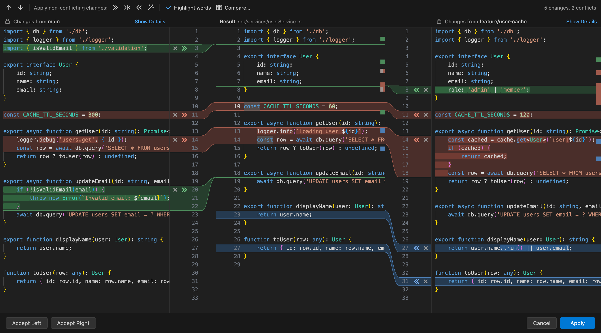

  

# MergeFlow

MergeFlow is a Git merge conflict resolver for Visual Studio Code with a clean three-pane layout: **Yours | Result | Theirs**. The layout is inspired by the merge dialog in JetBrains IDEs such as PhpStorm. You can see both versions side by side, take changes with one click, and edit the final result directly.

## Features

- **Three-pane merge editor.** *Yours* (read-only) on the left, the editable *Result* in the middle, *Theirs* (read-only) on the right, with syntax highlighting.
- **One-click actions in the gutter.** Each change has an accept arrow (`≫` on the left, `≪` on the right) and an ignore button (`✕`).
- **Conflicts resolved side by side.** Accepting one side of a conflict keeps the other side's arrow. You can still **append** it after the accepted change, or ignore it with `✕`. A conflict counts as resolved once both sides are handled, or once you edit it by hand.
- **Editable Result pane.** Type anywhere in the Result. Editing inside a conflict marks it as resolved. Undo and redo (`Ctrl/Cmd+Z`) work from any pane.
- **Accept Both** (left, then right) and **Revert Conflict Resolution**, from the context menu or the Command Palette.
- **Non-conflicting changes.** Apply them from the left side, the right side or both with one toolbar click. They can also be applied automatically when a file opens.
- **Resolve simple conflicts.** When both sides changed different words of the same lines, the magic wand combines them.
- **Conflict navigation.** Next and previous conflict (`F7` / `Shift+F7`), toolbar arrows, and a status line such as "2 changes. 1 conflict.".
- **Visual guidance.** Color-coded changes (conflict, modified, added, deleted), curved connectors between each change and its place in the Result, and optional changed-word highlighting.
- **Synchronized scrolling and resizable panes.** Drag a divider to resize the panes; double-click it to reset them.
- **Compare.** Open any two of Base, Yours, Theirs and Result in VS Code's diff editor.
- **Complete the merge.** **Apply** writes the Result to the file and marks it resolved in Git (`git add`). It never commits.
  - It checks for unresolved conflicts, unapplied changes, leftover conflict markers, and changes made to the file while you were merging.
- **Whole-file choices.** **Accept Left** / **Accept Right** resolve the file with one version. **Cancel** closes the editor without touching the file.
- **Merge Conflicts view.** Lists the conflicted files of each repository with their progress, and offers **Abort Merge…** (with confirmation).
- **Special cases handled.**
  - Files deleted or added on one side: choose *Keep File* or *Delete File*.
  - Binary files: choose *Use Yours* or *Use Theirs*.
  - Files that are not conflicted in Git's index: MergeFlow falls back to the conflict markers in the file.
- **Supported Git operations:** merge, rebase, cherry-pick and revert. The panes are labelled with the branch or commit on each side.

## Why MergeFlow?

Merge conflicts are easier to resolve when you can see all versions at once. MergeFlow shows exactly what each side changed, connects every change to its place in the Result, and lets you build the final file step by step.

## How It Works

| Pane | Content | Editable |
| --- | --- | --- |
| **Yours** (left) | Your local/current version: the branch you are merging *into* | No |
| **Result** (middle) | The final merged file. It starts as the common base version, and you build it by accepting, ignoring or editing changes | Yes |
| **Theirs** (right) | The incoming version: the branch or commit you are merging *in* | No |

Colors:

- Red blocks are conflicts, where both sides changed the same lines.
- Blue, green and grey blocks are non-conflicting modified, added and deleted lines.

When a side has been handled, its highlight disappears.

## Usage

1. Run a Git operation that produces conflicts, for example `git merge feature`.
2. Open a conflicted file in MergeFlow in any of these ways:
   - the **Merge Conflicts** view in the Activity Bar (click a file)
   - right-click the file in the Explorer or in Source Control → **Open in Merge Resolver**
   - the **Open in Merge Resolver** button in the editor title bar of a conflicted file
   - the Command Palette: **MergeFlow: Open in Merge Resolver**
3. Resolve each change:
   - Click `≫` / `≪` to accept a side, or `✕` to ignore it.
   - Use the toolbar to apply all non-conflicting changes, or the magic wand to resolve simple conflicts.
   - Edit the Result directly when you need a custom combination.
   - Use `F7` / `Shift+F7` to jump between conflicts.
4. Click **Apply** to save the Result and mark the file as resolved.
5. Review your changes and commit as usual. MergeFlow never commits for you.

### Keyboard shortcuts

| Action | macOS | Windows / Linux |
| --- | --- | --- |
| Next / previous conflict | `F7` / `Shift+F7` | `F7` / `Shift+F7` |
| Accept left change (Yours) | `Ctrl+Cmd+→` | `Ctrl+Alt+→` |
| Accept right change (Theirs) | `Ctrl+Cmd+←` | `Ctrl+Alt+←` |
| Undo / redo in Result | `Cmd+Z` / `Cmd+Shift+Z` | `Ctrl+Z` / `Ctrl+Shift+Z` |

### Settings

| Setting | Default | Description |
| --- | --- | --- |
| `phpstormMerge.autoApplyNonConflictingChanges` | `false` | Apply all non-conflicting changes automatically when a file is opened in MergeFlow. |

The change colors can be customized with the `phpstormMerge.*` colors in `workbench.colorCustomizations`, for example `phpstormMerge.conflictBackground`.

## Screenshots

<!--
  TODO: add screenshots before publishing. Put the image files in the `images/` folder and reference them with
  relative paths, for example:

  
  
  

  When packaging, vsce rewrites relative image paths to the public GitHub repository, so the images must be pushed
  there. Use PNG or JPG: the Marketplace does not allow SVG images in the README.
-->

_Screenshots coming soon._

## Requirements

- Visual Studio Code **1.80.0** or newer.
- Git, plus VS Code's built-in **Git** extension (enabled by default).

## Installation

Install **MergeFlow** from the Extensions view in VS Code (search for "MergeFlow") once it is available on the Visual Studio Marketplace.

To install a packaged build manually, open the Extensions view, click the **…** menu → **Install from VSIX…**, and select the `.vsix` file.

## Support

Report bugs and request features on [GitHub Issues](https://github.com/dharanikumar07/merge-conflict-resolver/issues).

## Contributing

Contributions are welcome:

1. Fork the repository and clone it.
2. Run `npm install`.
3. Run `npm run bundle` to build, or `npm run watch` to rebuild while you work.
4. Press `F5` in VS Code to launch an Extension Development Host with MergeFlow loaded.
5. Run the unit tests with `npm test`, and the end-to-end tests with `npm run test:e2e`, which starts a separate VS Code window.
6. Open a pull request with a clear description of the change.

## License

<!-- TODO: choose a license, add a LICENSE file and a "license" field in package.json, then update this section. -->

A license has not been chosen yet.
